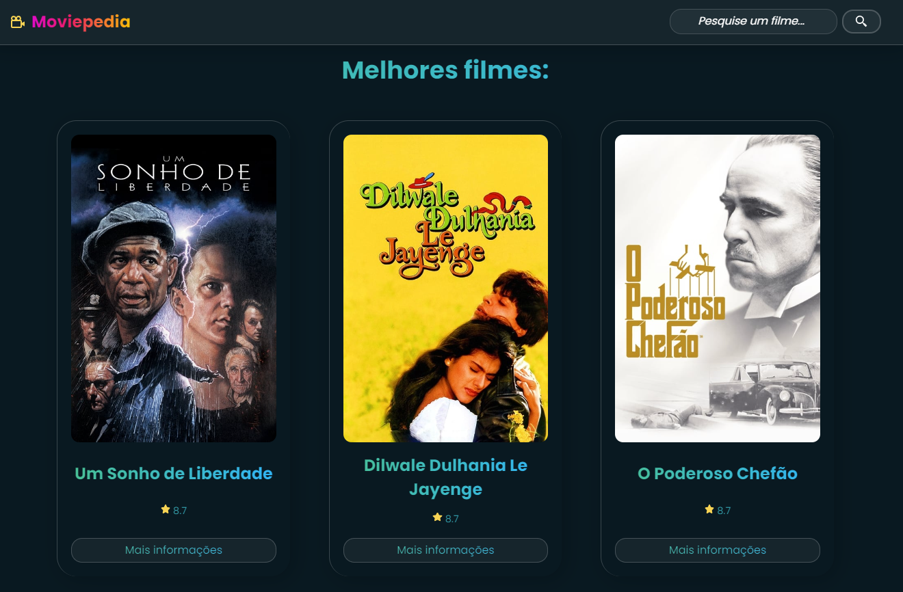

<h1 align="center">Moviepedia | Sua enciclopédia de filmes.</h1>

  <a href="#-tecnologias">Tecnologias</a>&nbsp;&nbsp;&nbsp;|&nbsp;&nbsp;&nbsp;
  <a href="#-projeto">Projeto</a>&nbsp;&nbsp;&nbsp;|&nbsp;&nbsp;&nbsp;
  <a href="#memo-licença">Licença</a>

 
  
  

    

  

 

  

# 📄 Descrição:

### O que será desenvolvido?

- Plataforma de eventos baseada no próprio evento Ignite Lab.

# 🚀 Tecnologias:

Esse projeto foi desenvolvido com as seguintes tecnologias:

### React

### TailwindCSS

### Vite App

### Apollo CLI

### GraphQL

### Phosphor-react

### Date-fns

### GraphCMS

### VimeJS

### React Router DOM

### GraphQL Code Generator

# 🚧 Projeto:

### [Confira aqui!](https://event-platform-five.vercel.app/)

# 🎨 Inspiração:

### Projeto desenvolvido durante o evento Ignite Lab da Rocketseat.

[Figma](<https://www.figma.com/file/JX79L923aZkozzQTFixNsw/Plataforma-de-evento---Ignite-Lab-(Community)?node-id=8%3A399/>)

# 📝 Licença

Esse projeto está sob a licença MIT. Veja o arquivo LICENSE para mais detalhes.

Made by Jhonatan Oliveira.
